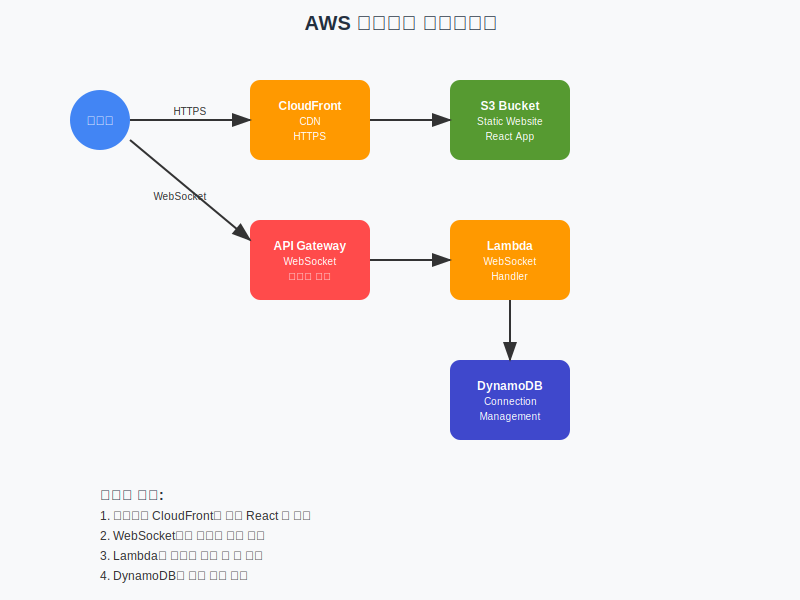

<div align="center">
  
  
  # 개성넘치는팀이름: 라스트바이트
  
  *마지막 한 바이트의 주인공이 되어볼까요?* 🍕💾
</div>

<div align="center">
  
</div>

## 어플리케이션 개요

구현하고자 하는 어플리케이션의 목적 및 기능과 같은 어플리케이션에 대한 설명을 입력합니다.

## 주요 기능

어플리케이션의 주요 기능 들을 설명합니다. 가능하다면 각 화면의 캡처를 기반으로 설명 자료를 작성합니다.

## 동영상 데모

Amazon Q Developer로 구현한 어플리케이션의 데모 영상을 입력합니다.
**Git의 Readme에는 GIF 형식으로 업로드하며, 원본 동영상은 발표 Presentation에 제출합니다.**

## 리소스 배포하기

### AWS 아키텍처



- IAM > 사용자 계정 > 보안 자격 증명 > 엑세스 키 설정

### 사전 준비

1. **AWS CLI 설정**

```bash
# Access Key ID, Secret Access Key, Region(us-east-1) 설정
aws configure
```

2. **Terraform 설치**

```bash
# macOS
brew install terraform

# 또는 공식 사이트에서 다운로드
```

3. **의존성 설치**

```bash
pnpm install
```

### 배포 방법

#### 최초 설정 (팀 리더만 실행)

```bash
# 1. 테라폼 상태 저장용 S3 버킷 생성
aws s3 mb s3://lastbyte-terraform-state --region us-east-1

# 2. 버킷 버전 관리 활성화
aws s3api put-bucket-versioning \
  --bucket lastbyte-terraform-state \
  --versioning-configuration Status=Enabled
```

#### 자동 배포 (권장)

```bash
terraform init
```

최초 배포시 테라폼 세팅을 해줍니다.

```bash
pnpm run iac:publish
```

전체 인프라 배포 및 웹사이트 업로드 진행

#### 수동 배포

```bash
# 1. Terraform 초기화
terraform init

# 2. 인프라 배포
terraform apply

# 3. 웹사이트 빌드
pnpm web build

# 4. S3에 업로드
aws s3 cp apps/website/dist/ s3://$(terraform output -raw s3_bucket_name)/ --recursive
```

### 배포 완료 후 출력 정보

배포가 성공하면 다음 정보들이 출력됩니다:

- **Website URL**: `https://[cloudfront-domain].cloudfront.net`
- **WebSocket URL**: `wss://[api-id].execute-api.us-east-1.amazonaws.com/prod`
- **S3 Bucket Name**: `my-static-website-[random-suffix]`

### 주요 AWS 서비스

| 서비스          | 용도                    | 비용 모델             |
| --------------- | ----------------------- | --------------------- |
| **S3**          | React 앱 정적 파일 저장 | 저장 용량 + 요청 수   |
| **CloudFront**  | CDN, HTTPS 제공         | 데이터 전송량         |
| **API Gateway** | WebSocket 엔드포인트    | 연결 시간 + 메시지 수 |
| **Lambda**      | 실시간 메시지 처리      | 실행 시간 + 요청 수   |
| **DynamoDB**    | 연결 상태 관리          | 읽기/쓰기 요청 수     |

### 리소스 삭제

#### 자동 삭제 (권장)

```bash
pnpm run iac:destroy
```

#### 수동 삭제

```bash
# 1. S3 버킷 내용 삭제
aws s3 rm s3://$(terraform output -raw s3_bucket_name) --recursive

# 2. Terraform 리소스 삭제
terraform destroy

# 3. 생성된 파일 정리
rm -f websocket_handler.zip
```

### 주의사항

- CloudFront 배포는 삭제 시 15-20분 소요될 수 있습니다
- DynamoDB 테이블은 즉시 삭제되지 않을 수 있습니다
- 모든 리소스가 삭제되었는지 AWS 콘솔에서 확인하세요

### 트러블슈팅

**배포 실패 시:**

- AWS 자격 증명 확인: `aws sts get-caller-identity`
- Terraform 상태 확인: `terraform plan`
- 로그 확인: CloudWatch Logs에서 Lambda 로그 확인

**"이미 존재하는 리소스" 에러 시:**

```bash
# 기존 리소스 완전 삭제 후 재배포
terraform destroy -auto-approve
terraform init -reconfigure
terraform apply -auto-approve
```

**WebSocket 연결 실패 시:**

- 브라우저 개발자 도구에서 네트워크 탭 확인
- WebSocket URL이 올바른지 확인
- CORS 설정 확인

## 프로젝트 기대 효과 및 예상 사용 사례

해당 프로젝트의 기대 효과와 예상되는 사용 사례를 작성합니다.

---
